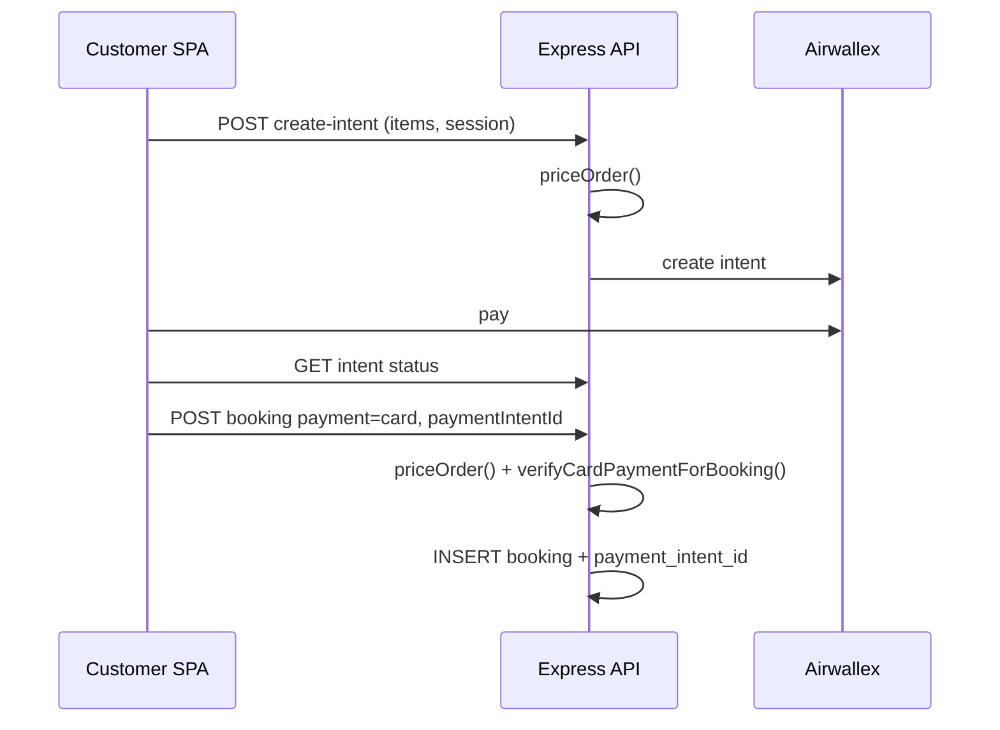

# Security Audit Report — KYND / Helpr

**Date:** 2026-09-16 (updated after logic + payment hardening)  
**Scope:** Full repository (`main`) — Express API (`backend/db`), storefront, admin, provider, superadmin  
**Method:** Manual code review + `npm audit --omit=dev` across all apps  
**Related:** [SYSTEM_ANALYSIS.md](./SYSTEM_ANALYSIS.md) (flows, architecture, non-security logic)

---

## Executive summary

Whole-project review found application and dependency issues. Remediation closed **critical/high auth and payment defects**, added **server-side pricing and card-payment verification**, hardened infrastructure defaults, and **cleared production dependency audits**.

| Severity | Found | Fixed | Residual |
|----------|------:|------:|---------:|
| Critical | 1 | 1 | 0 |
| High | 6 | 6 | 0 |
| Medium | 5 | 5 | 0 |
| Low | 2 | 2 | 0 |
| Deps (prod) | several | cleared (`npm audit --omit=dev` = 0 in all apps) | — |

**Operational residual (not CVEs):** bearer tokens in `localStorage` for cross-origin SPAs; forgot-password email not implemented; proxy-level rate limits recommended in production.

---

## Issues found → what we fixed

### 1. Critical — Profile IDOR (`PUT /api/auth/update-profile`)

**Issue:** Public `/auth` allowlist + client-supplied `userId` with no session check → anyone could change any user’s name/email.  
**Fix:** Require session; always update `session.id`.  
**File:** `backend/db/src/routes/auth.ts`

### 2. High — Change-password unbound to session

**Issue:** Trusted body `userId` on a public auth route.  
**Fix:** Require session; bind to `session.id`; min password length 8.  
**Files:** `backend/db/src/routes/auth.ts`, storefront/admin/superadmin auth UIs

### 3. High — No auth rate limiting

**Issue:** Login/signup could be brute-forced cheaply.  
**Fix:** In-memory per-IP limit (30 / 15 min → `429`) on all `/api/auth/*`. `trust proxy` in production for correct client IP.  
**Files:** `backend/db/src/routes/auth.ts`, `backend/db/src/server.ts`

### 4. High — Anonymous / tampered payments

**Issue:** Payment intents were anonymous; amount was client-controlled; booking could be created without proving card payment succeeded.  
**Fix:**
- Auth required for `POST /payments/create-intent` and `GET /payments/:id`
- Amount derived only via **`priceOrder()`** (items/addOns/schedule/offer — never body `amount`)
- Intent metadata includes `userId`; GET rejects wrong owner when metadata present
- **Card bookings:** `verifyCardPaymentForBooking()` — intent must be `SUCCEEDED`/`REQUIRES_CAPTURE`, match `merchantOrderId`, match server total, not reused
- Column **`bookings.payment_intent_id`** (unique); migration `004-booking-payment-intent.sql`
- Duplicate `booking_id` rejected with `409`  
**Files:** `backend/db/src/lib/paymentVerification.ts`, `backend/db/src/routes/payments.ts`, `backend/db/src/routes/bookings.ts`, `backend/db/src/http/session.ts`, `BookingConfirmed.jsx`, `ServiceDetail.jsx`, `Checkout.jsx`

### 5. High — Client-controlled booking totals / status

**Issue:** `POST /bookings` accepted client `total` and `status`.  
**Fix:** Force `status = 'upcoming'`; reprice via `priceOrder()`; allowlist payment methods (`cod|card|wallet|paynow`); persist server-priced line items.  
**File:** `backend/db/src/routes/bookings.ts`

### 6. High — Default MySQL password `root123`

**Issue:** Used whenever `MYSQL_PASSWORD` unset.  
**Fix:** Required in production; local-only fallback with warning.  
**File:** `backend/db/src/lib/mysql.ts`

### 7. Medium — Review claim of unlinked bookings

**Issue:** Any user could claim `user_id IS NULL` bookings and review them.  
**Fix:** Strict ownership (`user_id === session.id`).  
**File:** `backend/db/src/routes/reviews.ts`

### 8. Medium — SVG upload → stored XSS

**Issue:** SVG allowed in admin image upload.  
**Fix:** SVG removed from allowed MIME types / extensions.  
**File:** `backend/db/src/routes/images.ts`

### 9. Medium — Broken forgot-password minted unused tokens

**Issue:** Reset tokens stored with no email delivery (orphan tokens, confused UX).  
**Fix:** `POST /auth/forgot-password` and `/reset-password` return **503**; boot clears existing `reset_token` rows.  
**Files:** `backend/db/src/routes/auth.ts`, `backend/db/src/server.ts`

### 10. Medium — Offer abuse

**Issue:** Server applied promo IDs without eligibility checks.  
**Fix:** `priceOrder()` validates **`first`** (no prior non-cancelled bookings for user), **`bundle`** (≥3 service lines); unknown IDs ignored.  
**File:** `backend/db/src/lib/pricing.ts`

### 11. Medium / High — Vulnerable dependencies

| Action | Result |
|--------|--------|
| `npm audit fix` (backend `qs` / Express chain) | Clean |
| Upgrade `multer` → 2.x | Clean |
| Remove `xlsx` / `file-saver`; CSV export in superadmin | Removes high SheetJS CVE |
| Upgrade `react-router-dom` → **7.18.4** (all SPAs) | Clears moderate RR advisories |

**Verify:** `npm audit --omit=dev` in each app directory (storefront, `admin/`, `provider/`, `superadmin/`, `backend/db/`).

### 12. Low — Info leaks / weak policy

**Issue:** Login logged email/role; signup returned `error.message`; password min 6.  
**Fix:** Removed login log; generic signup errors; min password **8**. Admin elevation requires configured `ADMIN_SIGNUP_SECRET` (≥16 chars).

### 13. Hardening extras

- Security headers: `X-Content-Type-Options`, `Referrer-Policy`, `X-Frame-Options`, `Permissions-Policy`, HSTS in production  
- JSON body limit **1 MB**  
- Storefront sends `catalogId` + SGT `scheduledAt` (`+08:00`) for consistent server pricing  
- Cart/checkout routes re-enabled with same pricing/payment rules as ServiceDetail  

---

## Server-side pricing (`priceOrder`)

**Files:** `backend/db/src/lib/pricing.ts`, `backend/db/src/lib/pricingRules.ts`

1. Resolve items via `catalogId` / slug → `catalog_services`
2. If `service_pricing_rules` exist, compute partner cost (hourly / flat / per_unit / tiered); else `default_partner_cost`
3. Reject inactive services and **custom_quote** (null cost) for online checkout
4. Sell = partner cost × (1 + markup%); recurring schedule → **15%** off service base
5. Add-ons validated against `service_addons` links
6. Offers applied only when eligible (see §10)
7. Cap total at **S$50,000**

Same function powers **`POST /payments/create-intent`** and **`POST /bookings`**, so intent amount and booking total stay aligned when the client sends the same item payload.

---

## Card checkout flow (security-relevant)

---

## Deployment checklist (security)

1. Set strong `SESSION_SECRET` (≥16 chars), `MYSQL_PASSWORD`, `INTERNAL_API_TOKEN`, Airwallex and WhatsApp secrets in `backend/db/.env.local` or Docker env.  
2. Run migrations on existing DBs, including:  
   `backend/db/migrations/004-booking-payment-intent.sql`  
3. Set `NODE_ENV=production` and `ALLOWED_ORIGINS` for production SPAs.  
4. Add reverse-proxy rate limits on `/api/auth/*` (in-app limiter is per-process only).  
5. Re-run `npm audit --omit=dev` after dependency changes.

---

## Residual / follow-ups (non-blocking)

| Item | Notes |
|------|--------|
| Bearer tokens in `localStorage` | Required for cross-origin dev/prod SPAs; reduce XSS risk with CSP, sanitize output |
| Forgot-password email | Re-enable endpoints only after SES/SendGrid (or similar) is wired |
| Wallet / PayNow | Allowed as payment labels; no ledger reconciliation yet — treat as trust-on-delivery like COD operationally |
| Legacy `services` vs `catalog_services` | Some city/help pages still use legacy tables — catalog is authoritative for checkout |
| `react-router-dom` v7 | Smoke-test all SPAs after upgrade |

---

## Files touched (remediation)

| Area | Files |
|------|--------|
| Auth | `backend/db/src/routes/auth.ts`, `src/context/AuthContext.jsx`, `admin/src/context/AuthContext.jsx`, `superadmin/src/pages/Settings.tsx` |
| Gate / server | `backend/db/src/http/session.ts`, `backend/db/src/server.ts` |
| Pricing | `backend/db/src/lib/pricing.ts`, `backend/db/src/lib/pricingRules.ts` |
| Payments | `backend/db/src/lib/paymentVerification.ts`, `backend/db/src/routes/payments.ts` |
| Bookings | `backend/db/src/routes/bookings.ts`, `backend/db/db.sql`, `backend/db/migrations/004-booking-payment-intent.sql` |
| Other API | `reviews.ts`, `images.ts`, `mysql.ts` |
| Storefront | `ServiceDetail.jsx`, `Checkout.jsx`, `BookingConfirmed.jsx`, `CartContext.jsx`, `App.jsx`, `main.jsx`, `src/lib/sgt.js` |
| Superadmin | `Clients.tsx` (CSV export; removed `xlsx`) |
| Deps | multer 2.x, react-router-dom 7.18.4 |

---

*Last updated 2026-09-16. Re-run `npm audit --omit=dev` in each app after future dependency bumps.*
