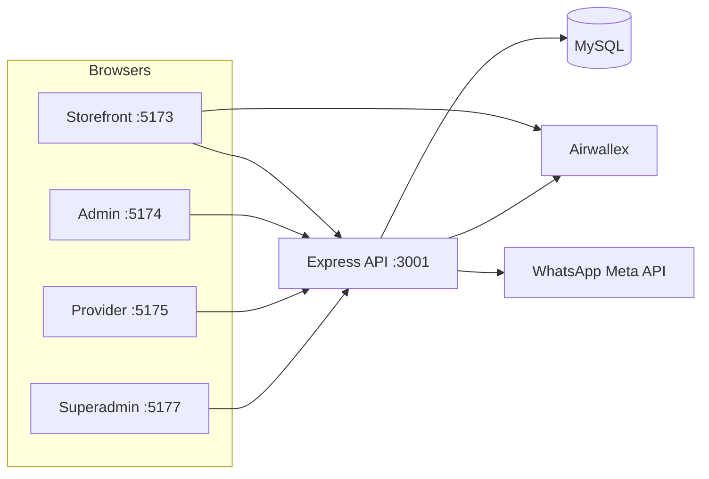
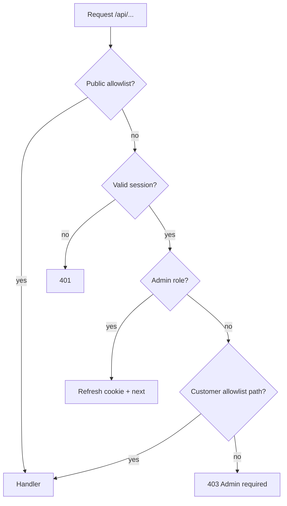
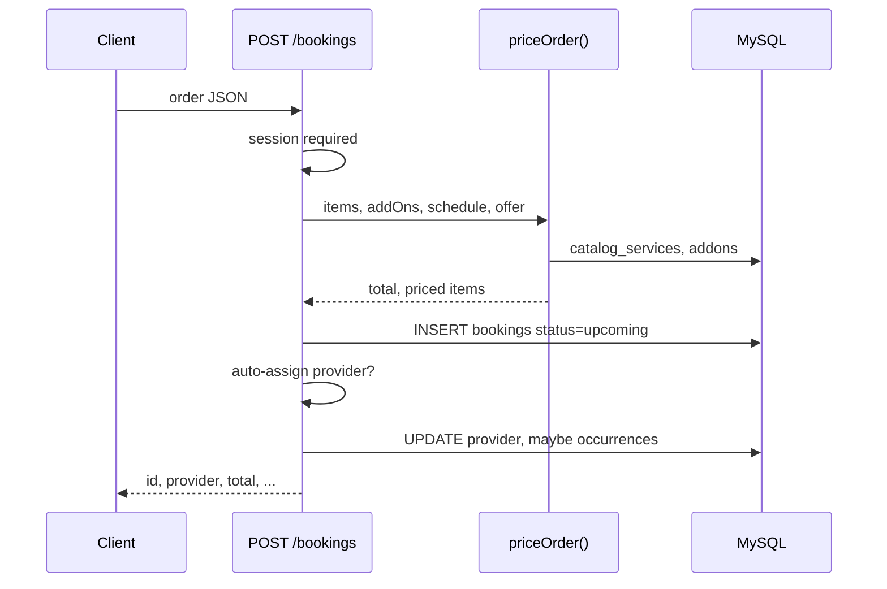
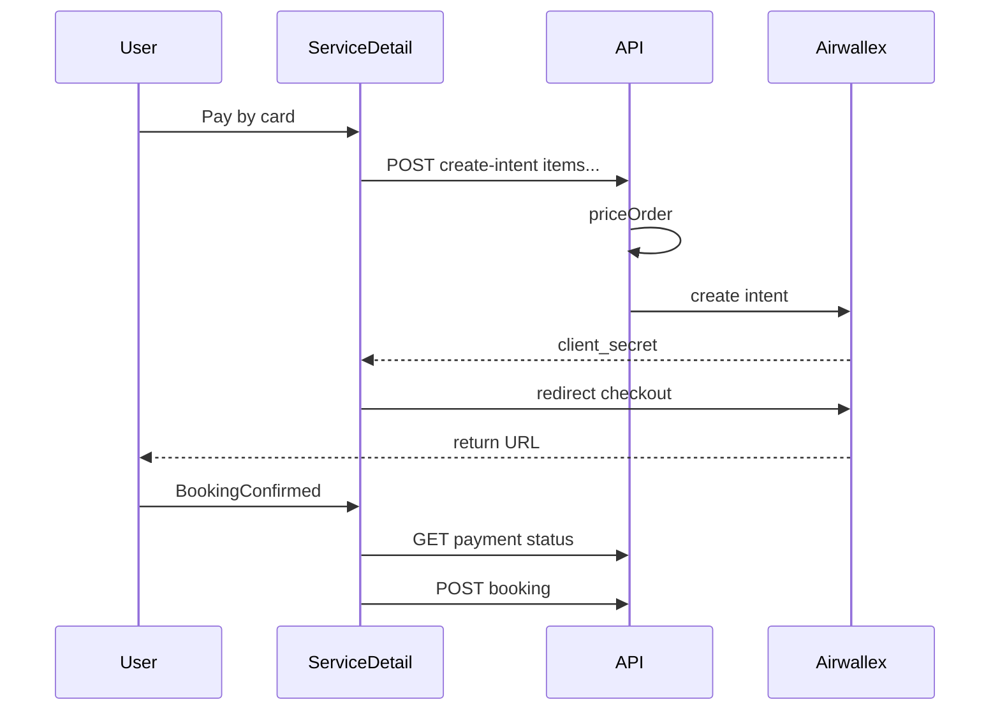

# System Analysis — Logic, Flows & Architecture

**Date:** 2026-09-16  
**Scope:** Entire KYND / Helpr monorepo (storefront, admin, provider, superadmin, Express API, MySQL)  
**Companion:** [SECURITY_AUDIT.md](./SECURITY_AUDIT.md) (vulnerabilities and fixes)

This document explains **how the product works end-to-end**: apps, auth, data models, booking/payment/recurrence, and known logic gaps.

---

## 1. Repository topology

| App | Path | Dev port (via `npm run dev:all`) | Role |
|-----|------|-------------------------------------|------|
| Customer storefront | `.` | `:5173` | Browse services, book, pay, account |
| Admin console | `admin/` | `:5174` → `/admin` | Legacy/simple admin panel |
| Provider portal | `provider/` | `:5175` → `/provider` | Assigned jobs, status updates |
| Superadmin | `superadmin/` | `:5177` → `/superadmin` | Catalog, clients, orders, analytics |
| API | `backend/db/` | `:3001` | Single Express app, `/api/*` |

Each app has its own `package.json` and lockfile. Root scripts orchestrate install/build/docker; there is no npm workspace.

**Dev routing:** Storefront Vite proxies `/api` and `/images` to the API, and `/admin`, `/provider`, `/superadmin` to sibling Vite apps (`vite.config.js`).

**Production:** Docker or Apache serves built SPAs + proxies API (see `DEPLOYMENT_*.md`).

---

## 2. API bootstrap and request pipeline

**Boot (`backend/db/src/server.ts`):**

1. Load `.env.local` / `.env`
2. CORS, security headers, `cookie-parser`, JSON body (1 MB cap)
3. Static files from `backend/db/public` (service images at `/images/...`)
4. `GET /health`
5. Clear stale password `reset_token` rows (forgot-password disabled)
6. **`/api` → `apiAuthGate` → resource routers**

**Every `/api` request** passes `apiAuthGate` (`backend/db/src/http/session.ts`):

### 2.1 Public (no session)

- All `/auth/*` (login, signup, provider-login; rate-limited)
- All `/provider/*` (handlers enforce provider/admin role)
- All `/internal/*` (handlers enforce `INTERNAL_API_TOKEN`)
- GET catalog, cities, subcategories, availability, image list, legacy `/services`
- POST `/waitlist`

### 2.2 Authenticated customer (`role` = `user`, etc.)

- GET/POST `/bookings`, PATCH `/bookings/:id`
- POST `/payments/create-intent`, GET `/payments/:id`
- POST `/reviews`

### 2.3 Admin (`admin`, `super_admin`)

- Everything else (dashboard, CRUD, orders, clients, uploads, etc.)

**Session model:** HMAC-signed JWT-like token (`backend/db/src/lib/auth.ts`), 8h TTL. Delivered as:

- `httpOnly` cookie `admin_session` (same-site friendly)
- JSON `token` on login (for cross-origin Bearer header)

Storefront/admin/provider/superadmin persist token + profile in **separate** `localStorage` keys.

---

## 3. Identity and roles

| Role | Table | Login route | `session.id` meaning |
|------|--------|-------------|----------------------|
| Customer | `users` | `POST /auth/login` | `users.id` |
| Admin | `users` | same | `users.id` (role checked in admin UIs) |
| Super admin | `users` | signup + `ADMIN_SIGNUP_SECRET` | `users.id` |
| Provider | `service_providers` | `POST /auth/provider-login` | **`service_providers.id`** |

**Important:** Provider routes filter `bookings.provider_id = session.id`. Provider tokens must never reuse a customer `users.id`.

**Admin UIs:** `admin` and `superadmin` reject login if `role` is not admin-tier (client-side + API gate for most routes).

---

## 4. Data model (conceptual)

MySQL schema: `backend/db/db.sql` (~25 tables). Two parallel “service” worlds coexist:

| Layer | Tables | Used by |
|-------|--------|---------|
| **Legacy storefront list** | `services`, `service_categories`, `service_subcategories`, `city_services`, `cities` | City/help pages, some admin paths |
| **Modular catalog (source of truth for booking)** | `catalog_categories`, `catalog_services`, `service_pricing_rules`, `service_booking_modes`, `addons`, `service_addons` | Storefront `ServicesContext`, superadmin catalog, **`priceOrder()`** |

**Bookings** are the operational core:

- One row in `bookings` per order (human ref `booking_id`, JSON `items`, `total`, contact fields, `user_id`, `provider_id`, `schedule`, `recurrence`, `history`, …)
- **Recurring:** extra rows in `booking_occurrences` (one per visit, `seq`, `scheduled_at`, `notified_at`, status)

**Reviews** link `booking_id`, `user_id`, `provider_id`.

**Waitlist** for pre-launch landing (`Launch.jsx` → POST `/waitlist`).

---

## 5. Storefront application flow

### 5.1 Launch gate

`src/lib/launch.js` + `LaunchGate` in `App.jsx`:

- Until `VITE_LAUNCH_AT` (or demo countdown in `localStorage` `kynd:launchAt`), all routes show `Launch.jsx`
- `?launch=preview` / `?launch=reset` for testing

### 5.2 Routing (active paths)

Primary journey: **Home → Services / Help subcategory → ServiceDetail → BookingConfirmed → Bookings**.

**Commented out / inactive in `App.jsx` and `main.jsx`:**

- `CartProvider`, `/cart`, `/checkout` — cart multi-item checkout is **not wired**; booking is **single-page on ServiceDetail**.

### 5.3 Service discovery

- `ServicesProvider` loads **`GET /catalog/services`** and maps rows via `mapCatalogService()` (`src/lib/catalogServices.js`): slug from name, sell price from `default_partner_cost` + 30% markup (or override).
- `ServiceDetail` resolves service by URL `:slug` from that list.
- Add-ons: **`GET /catalog/services/:id/addons`**
- Optional quote API exists (`GET /catalog/services/:id/quote`) for hourly/tiered rules — **not used** in the main ServiceDetail price bar (uses flat catalog cost like cart would).

### 5.4 ServiceDetail booking UX (logic)

Accordion sections: schedule (instant / scheduled / recurring) → address → add-ons → payment.

**Client-side price display:**

- Base = sum of selected services’ display prices
- + add-on `customer_price`
- If recurring: × **0.85** on base (15% off services only)
- − offer discount (`src/lib/offers.js`: `first`, `refer`, `bundle` — stored in `localStorage`)

**Submit (`onSubmit`):**

1. Requires login (`useAuth` token)
2. Builds `order` with `items` (includes `catalogId` when from catalog), `addOns`, `offer`, contact, `payment`, etc.
3. **COD / wallet:** `POST /api/bookings` immediately
4. **Card:** `POST /api/payments/create-intent` with **items/addOns/schedule/offer** (not raw amount) → Airwallex redirect → return to `/booking/confirmed`

### 5.5 BookingConfirmed (card path)

If no `location.state`, reads `kynd.pendingOrder` from localStorage:

1. `GET /api/payments/:intentId` — status must be `SUCCEEDED` or `REQUIRES_CAPTURE`
2. `POST /api/bookings` with stored order payload
3. Clears pending, sets `kynd.lastOrder`

**Gap:** Booking create does **not** require `paymentIntentId` or proof that Airwallex amount equals server repriced total (see §8).

### 5.6 BookingsContext

- Logged-in: sync from `GET /api/bookings` (filtered server-side by `user_id`)
- Guest: localStorage `kynd.bookings.v1` only
- Cancel: PATCH `/bookings/:id` with ownership check on server
- Transforms API rows to camelCase; parses SGT datetimes via `+08:00` suffix

---

## 6. Server-side booking create (detailed)

`POST /api/bookings` (`backend/db/src/routes/bookings.ts`):

**Steps:**

1. Validate contact (Singapore 6-digit postal code, required fields).
2. **`priceOrder()`** — ignores client `total`; recomputes from DB (see §7).
3. Force `status = 'upcoming'`; allowlist payment method.
4. Normalize recurrence if `schedule === 'recurring'` (`normalizeRecurrence` → up to 4 planned visit ISO strings).
5. Insert booking; `user_id = session.id`.
6. **Auto-assignment** (if provider found):
   - Match providers in same city, `JSON_CONTAINS(services, serviceName)`, else city-only fallback.
   - For non-instant with `scheduledAt`: score providers who can cover **all** recurrence visits (working hours + no overlap).
   - **Instant bookings** skip availability scoring — first candidate wins.
   - Increments `service_providers.total_jobs`.
   - **Does not send WhatsApp** (unlike admin manual assign).
7. If recurring plan exists: `createOccurrences()` → `booking_occurrences` rows.

**Admin assign:** `PUT /bookings/:id` with `provider_id` — admin only; increments `total_jobs` again; **sends WhatsApp** once.

---

## 7. Pricing logic (`priceOrder`)

**File:** `backend/db/src/lib/pricing.ts`

| Input | Server behavior |
|--------|-----------------|
| Line items | Resolve `catalogId` / slug / name → `catalog_services` |
| Unit price | `round(partner_cost × (1 + markup%))` |
| Custom quote (`partner_cost` null) | **Reject** online booking |
| Recurring | 15% off **service base** (before add-ons) |
| Add-ons | Must be linked via `service_addons` to booked service or category |
| Offers | Same IDs as client: `first` ($10 cap), `refer` ($15 cap), `bundle` (15% if ≥3 **line items**) |
| Cap | Max total S$50,000 |

**Alignment with UI:**

- Matches ServiceDetail **when** catalog flat cost equals UI `price` and same offer/recurring rules apply.
- **Does not** use `service_pricing_rules` (hourly/tiered/custom_quote strategies) — those exist on quote endpoint only.
- **Offers are not eligibility-checked** (e.g. “first booking” not verified against history).

**Payment intent:** Same `priceOrder()` on `POST /payments/create-intent` — Airwallex charged amount should match booking total **if** the same payload is sent to both endpoints.

---

## 8. Payment flow (Airwallex)

**Library:** `backend/db/src/lib/airwallex.ts` — OAuth token, create/retrieve PaymentIntent.

**Gaps / risks (logic, not yet fully closed):**

1. **Paid booking not tied to intent** — After payment succeeds, `POST /bookings` does not store `paymentIntentId` or verify `payment === 'card'` implies succeeded intent.
2. **Double path** — User could POST booking with `payment: 'cod'` while a card intent exists.
3. **Amount drift** — If client sent different items to create-intent vs booking (or offer changed), Airwallex amount may differ from final booking `total` (both server-priced, but two separate calls).
4. **Wallet** — Allowed server-side; UI exposes wallet radio but behavior is same as COD (direct booking, no wallet ledger in DB).

---

## 9. Recurring visits & dispatch

**Planning:** `recurrence.ts` — presets (`weekly`, …) or custom `{ times, unit }` → `intervalDays` + **4** occurrence timestamps.

**Persistence:** `occurrences.ts`

- `createOccurrences` on booking create (recurring only)
- `topUpOccurrences` keeps **4 upcoming** visits ahead
- `findDueOccurrences(withinHours)` for cron
- `completeNextOccurrence` when provider marks recurring job complete (provider route)

**Cron:** `POST /api/internal/dispatch-due` with Bearer `INTERNAL_API_TOKEN`:

- WhatsApp partner for visits starting within N hours (default 24)
- Sets `notified_at` only on success
- Tops up series for touched bookings

**Provider completion:** Recurring “complete” completes **one occurrence**, not whole series; one-off completes booking row.

---

## 10. Provider portal

- Login: `/auth/provider-login` → token with `role: provider`
- `GET /api/provider/bookings` — `WHERE provider_id = session.id`
- `PUT /api/provider/bookings/:id` — status; recurring complete uses occurrence helper; ownership enforced for providers

Gate: `/provider/*` is public at middleware level; **must** have valid session in handler (401 if missing).

---

## 11. Admin & superadmin

| Console | Scope |
|---------|--------|
| **admin/** | Single `AdminPanel` — catalog services CRUD, login/signup |
| **superadmin/** | Dashboard, clients (CSV export), orders (= bookings view), catalog, addons, help moments (subcategories), pros, city services, users, settings |

Superadmin uses `apiFetch()` (`superadmin/src/lib/api.ts`) — rewrites `/api/...` to `VITE_API_BASE` + attaches Bearer token.

**Orders vs bookings:** `GET /api/orders` duplicates booking list shape for superadmin; mutations go to `/bookings`.

**Clients:** Merges `clients` table + aggregated booking contacts (by phone dedupe).

---

## 11. Timezone (SGT)

- DB stores **Singapore wall-clock** in `DATETIME`
- API writes via `sgtDateTime()`; reads often use `DATE_FORMAT` or `+08:00` in JSON for storefront
- mysql2 pool uses `dateStrings: true` and `SET time_zone = '+08:00'`
- **Client risk:** `ServiceDetail` builds `scheduledAt` with `new Date(\`${date}T${time}\`)` (local browser TZ), not explicit +08:00 — can skew scheduled times for users outside SG

---

## 12. Availability API

`GET /availability` — given city, service, date: loads providers, working hours JSON, existing bookings, returns slot strings (30-min steps). Used in ServiceDetail date/time picker for scheduled flows.

---

## 13. Reviews

`POST /api/reviews` — session required; booking must belong to `session.id`; updates provider `rating` / `review_count` aggregate.

---

## 14. Legacy / duplicate surfaces

| Item | Notes |
|------|--------|
| `services` router | Public GET; older table; not used by `ServicesContext` |
| `products` / `orders` (legacy) | Orders router reads **bookings** |
| Cart + Checkout pages | Present in repo, **disabled** in router |
| `Checkout.jsx` | Still maintained; would work if routes re-enabled |
| Forgot / reset password pages | UI exists; API returns **503** (email not implemented) |
| `change-password` / `update-profile` | Require session; superadmin Settings uses them |

---

## 15. Logic gaps — status (2026-09-16)

| # | Area | Status |
|---|------|--------|
| 1 | Card checkout ↔ PaymentIntent | **Fixed** — `payment_intent_id` column, verify before insert |
| 2 | Pricing rules on checkout | **Fixed** — `priceOrder` uses `service_pricing_rules` when configured |
| 3 | Offer eligibility | **Fixed** — first/bundle validated server-side |
| 4 | Instant assign availability | **Fixed** — same engine as scheduled |
| 5 | `total_jobs` double count | **Fixed** — increment only on first assign |
| 6 | WhatsApp on auto-assign | **Fixed** — notify after auto-assign |
| 7 | SGT `scheduledAt` | **Fixed** — `+08:00` via `toSgtIsoFromParts` |
| 8 | Cart / checkout | **Fixed** — routes and `CartProvider` re-enabled |
| 9 | Dual catalogs | **Open** — legacy tables still used on some city/help pages |
| 10 | Guest bookings | **By design** — localStorage until login |

Run migration `backend/db/migrations/004-booking-payment-intent.sql` on existing DBs.

---

## 16. Environment & ops (flow-related)

| Variable | Affects |
|----------|---------|
| `SESSION_SECRET` | All sessions (required ≥16 chars) |
| `MYSQL_*` | All persistence |
| `INTERNAL_API_TOKEN` | Dispatch cron |
| `AIRWALLEX_*` | Card payments |
| `WHATSAPP_*` | Partner notifications |
| `VITE_API_BASE` / `VITE_LAUNCH_AT` | SPA build-time behavior |
| `ALLOWED_ORIGINS` | CORS for production SPAs |

---

## 17. Quick reference — main customer happy path

1. Pass launch gate → browse catalog services  
2. Open ServiceDetail → pick schedule, address, add-ons, offer, payment  
3. Login if needed  
4. **COD/wallet:** API creates booking → confirmed page  
5. **Card:** API prices intent → Airwallex → confirmed page verifies → API creates booking  
6. Bookings list from API; cancel/reschedule via PATCH  
7. After visit, review (own booking only)  
8. Recurring: occurrences + cron WhatsApp; provider completes visit-by-visit  

---

*For security-specific findings and remediation status, see [SECURITY_AUDIT.md](./SECURITY_AUDIT.md).*
